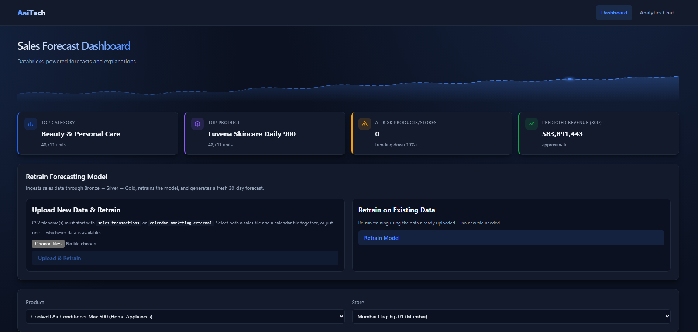

# Sales AI — Retail Sales Forecasting & GenAI Decision Support Platform

An AI-powered platform that forecasts retail sales and provides GenAI-driven decision support.



## Overview

**Sales AI** helps retail businesses:
- Forecast sales using ML/statistical models
- Monitor KPIs through an interactive dashboard
- Get GenAI insights and recommendations
- Retrain models with new data

## Tech Stack

- **Backend**: FastAPI (Python)
- **Frontend**: React + TypeScript
- **ML**: Prophet, XGBoost, scikit-learn, TensorFlow
- **GenAI**: OpenAI API

## Prerequisites

- Python 3.12+
- Node.js 18+
- [uv](https://docs.astral.sh/uv/getting-started/)

## Setup

### 1. Configure Environment Variables

**Backend:** Copy `backend/.env.example` to `backend/.env` and update with your values:
```bash
cp backend/.env.example backend/.env
```

### 2. Install Dependencies

```bash
uv sync
```

### 3. Start Backend

```bash
cd backend && python main.py
```

API docs: `http://localhost:8000/docs`

### 4. Start Frontend

In a new terminal:

```bash
cd frontend && npm run dev
```

Frontend: `http://localhost:5173`

## License

MIT License

---

**Follow along:** [AaiTech - Sandesh Hase](https://youtube.com/@sandesh-hase?si=oaopw_Sq6xZKDsca)
